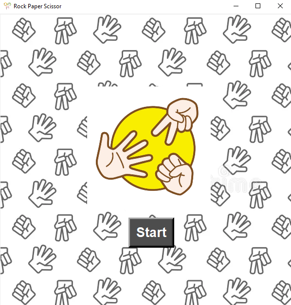
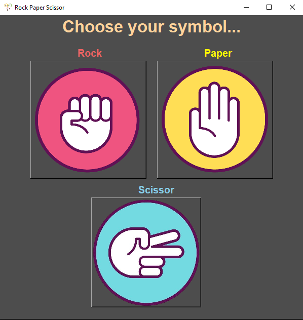

# Stone-Paper-Scissors

Here is the Stone-Paper-Scissors Game using python tkinter.

This is a simple GUI-based Stone-Paper-Scissors game built with Python and Tkinter. The game allows the player to choose between "Stone," "Paper," or "Scissors," and then plays against the computer, which makes a random choice. The game shows the result of each round (Win, Lose, or Draw)

# Features

- Interactive and easy-to-use GUI
- Randomized computer moves for a fair challenge
- Simple yet visually engaging design

# How to Run

Clone the Repository

```bash
    git clone https://github.com/Mukeshp405/Stone-Paper-Scissors.git
```

Go to the project directory

```bash
    cd Stone-Paper-Scissors
```

Run the file

```bash
    python main.py
```

# Requirements

- Python 3.x

Go to this link and download
[Download Python](https://www.python.org/downloads/)

- Tkinter

Install Tkinter

```bash
    pip install tkinter
```

# Interface

- Starting Page

<p align="center">
    
</p>

- Selection Page

<p align="center">
    
</p>
